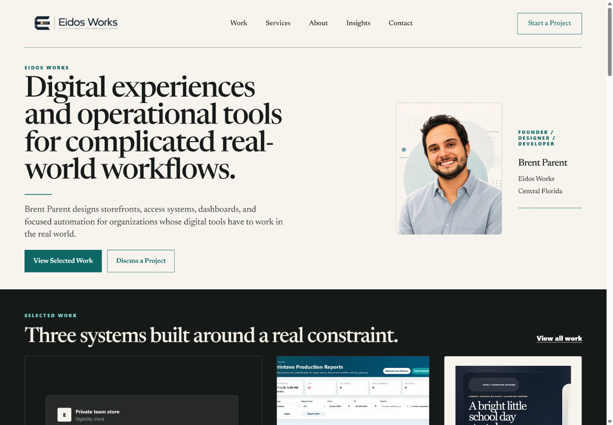
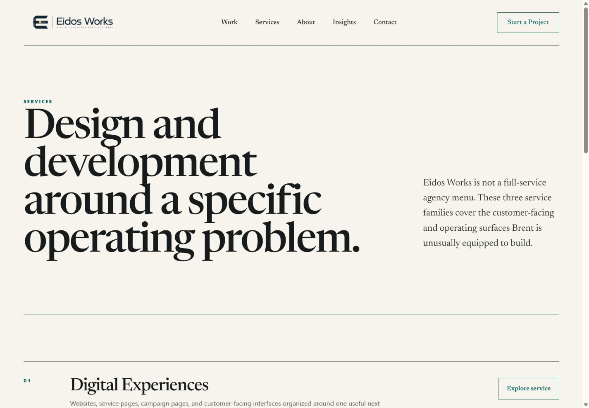
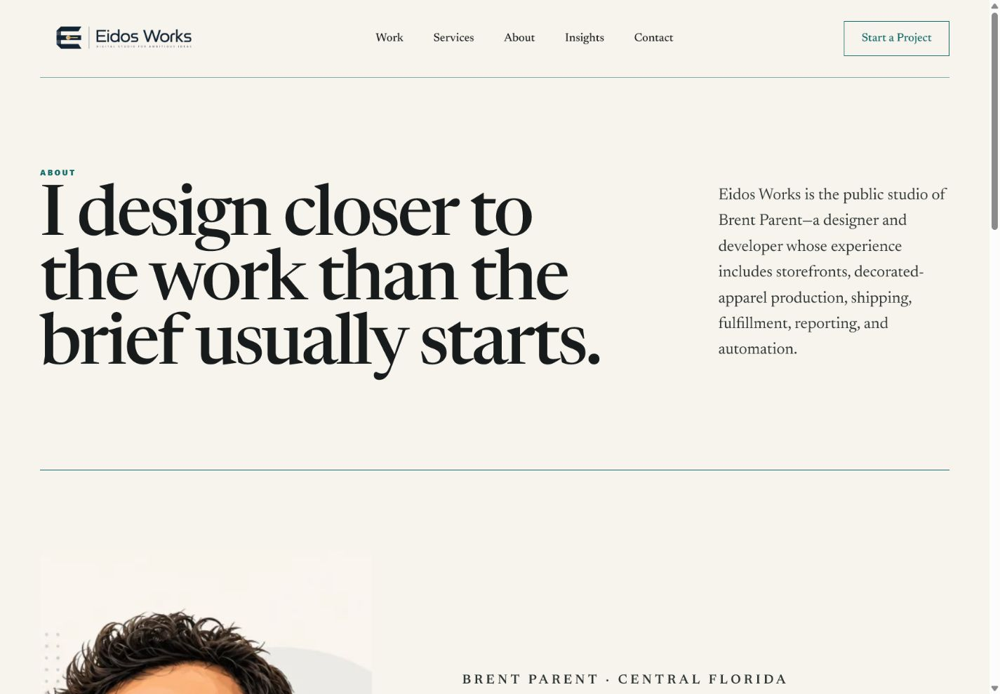
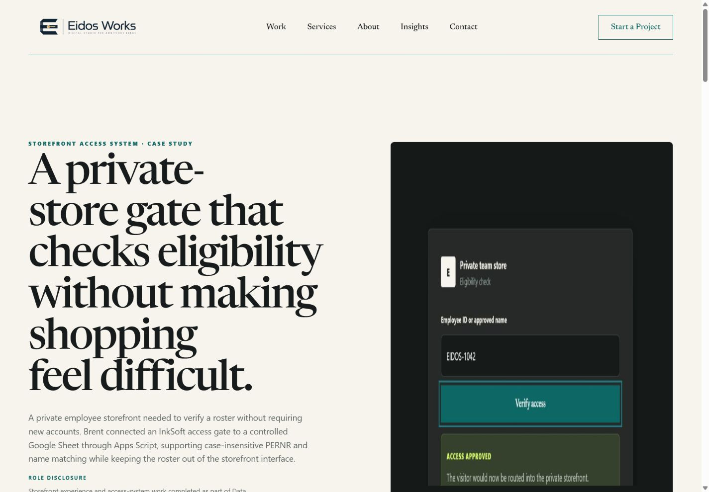
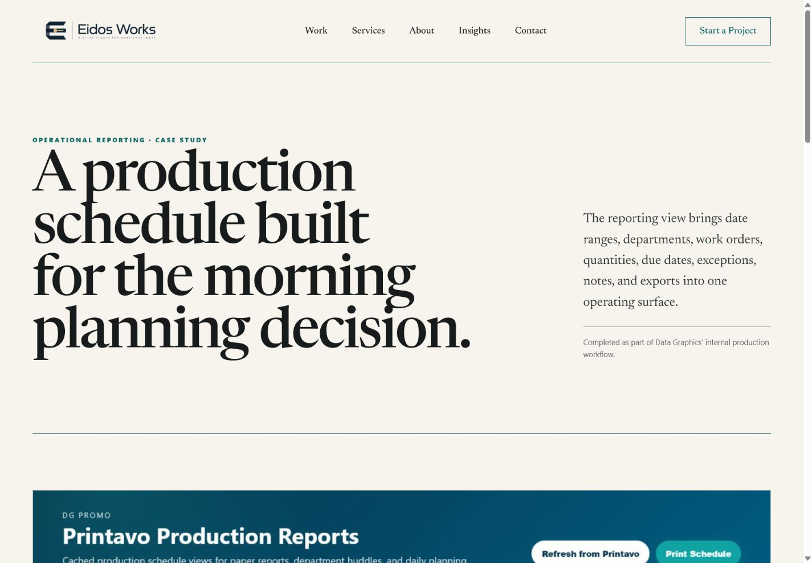
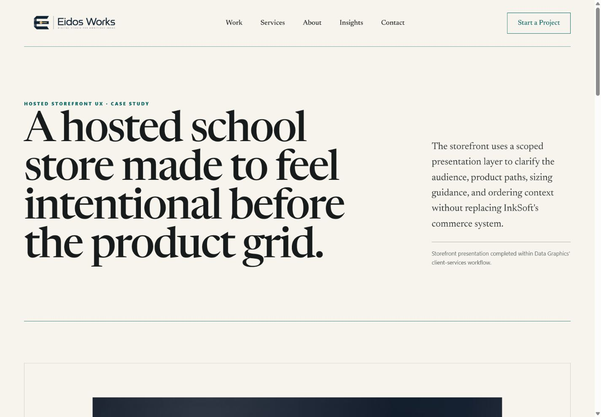

# Production Audit — Studio Positioning Refinement

## Audit scope

Current production pages at `https://eidos-works.com`: homepage, Services, About, PERNR access gate, production dashboard, and storefront transformation. The user goal is to understand Eidos Works as a credible studio led by Brent, with accurate attribution and project imagery.

## Step 1 — Homepage

Health: structurally strong, positioning needs correction.

- Strength: the editorial hierarchy, restrained palette, navigation, and selected-work rail are clear.
- UX risk: the portrait and founder card occupy the primary proof position, so the page reads as Brent's personal portfolio rather than Eidos Works' studio site.
- Copy risk: “Brent Parent designs…” assigns the studio's complete output to one person.
- Opportunity: replace the portrait block with a three-project work composition and keep only a subtle founder line.

## Step 2 — Services

Health: clear structure, weak customer orientation and proof.

- Strength: the three-service architecture is easy to scan.
- UX risk: the introduction explains the menu and calls the services “families” and “surfaces.”
- Trust risk: no project imagery supports the capability claims.
- Opportunity: use customer-problem copy and matched evidence imagery for each service.

## Step 3 — About

Health: correct place for founder identity, biography needs studio framing.

- Strength: the portrait is appropriate here and the operational background is concrete.
- Copy risk: first-person language does not explain how Eidos Works can work with collaborators, client teams, platforms, or technical resources.
- Opportunity: keep one portrait, identify Brent as founder and principal, and clarify the studio/business/research boundaries.

## Step 4 — PERNR access gate

Health: strong evidence and safety boundary, attribution too individual.

- Strength: the safe demo, role disclosure, and public evidence are clear.
- Copy risk: the introduction says Brent alone connected and implemented the complete solution.
- Opportunity: lead with simpler private-store access and roster management, then retain architecture as supporting proof.

## Step 5 — Production dashboard

Health: authentic evidence, introduction is overly abstract.

- Strength: the real interface and Data Graphics internal-work disclosure support trust.
- Copy risk: “operating surface” and the later “human operator uses the view” describe the interface rather than the production decision.
- Opportunity: state what teams can see and do: late work, next due work, active status, filtering, follow-up, and exports.

## Step 6 — Storefront transformation

Health: credible main evidence, narrative mixes finished work with uncertain supporting artwork.

- Strength: the framed public storefront view and Data Graphics client-services disclosure are specific.
- Copy risk: “scoped presentation layer” is implementation language in the introduction.
- Evidence risk: the classroom artwork is associated with the project in the registry, but current repository evidence does not prove live use.
- Opportunity: lead with the family's shopping path, keep the InkSoft constraint as a secondary technical note, and remove uncertain concept imagery from the finished-result narrative.

## Accessibility evidence limits

Screenshots confirm hierarchy, readable contrast, and large targets at the sampled desktop viewport. Keyboard behavior, focus, reduced motion, form errors, touch targets, responsive reflow, and image loading require implementation-level checks after the edits. This audit does not claim complete WCAG conformance.
