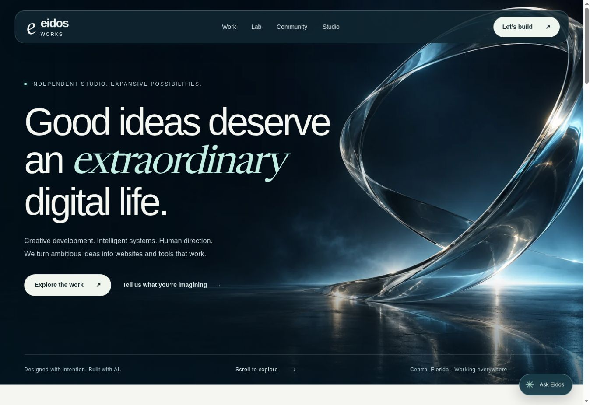
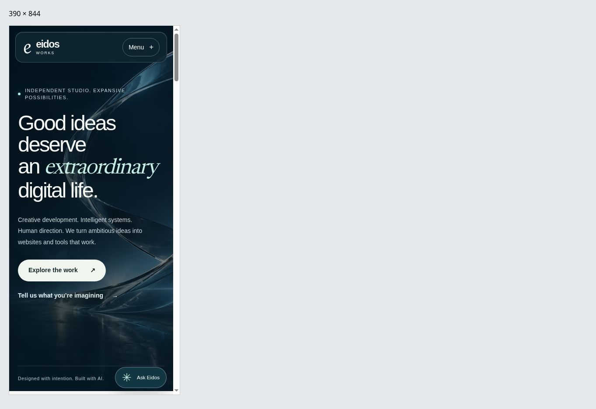
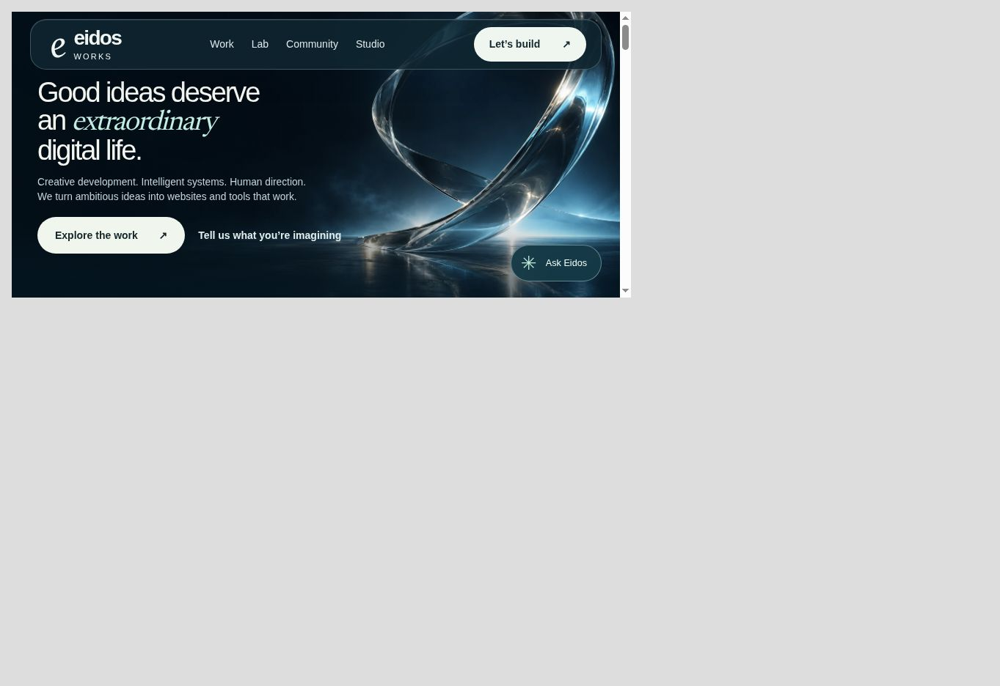

# Eidos Works preview verification

Verified September 5, 2026. Review site: https://eidos-works-preview.vercel.app/

This is a separate, noindex Vercel review deployment. The public Eidos Works domain and the production Sentinel Lab were not changed. The preview serves the built site and the actual published-source assistant handler with provider credentials absent. Account-dependent features report their unavailable state.

## Visual and interaction checks

| Surface | Observed result |
| --- | --- |
| Desktop, 1363 × 936 browser | Glass header, headline, original hero artwork, and both calls to action render cleanly. No horizontal overflow. Project images finish loading after scrolling. |
| Portrait, 390 × 844 iframe | Readable headline wrapping and compact navigation. No horizontal overflow (375px content width including the browser's scrollbar allowance). |
| Landscape, 844 × 390 iframe | Fixed excessive hero height and spacing. Headline, description, and both calls to action now fit in the first screen. No horizontal overflow (829px content width). |
| Narrow portrait, 320 × 640 iframe | Menu opens and closes, expanded state is exposed, and navigation links appear. No horizontal overflow before or after opening (305px content width). |
| Work collection | All six projects render; the Storefronts filter changes the live status to three projects and shows the matching cards. |
| Starter preview | Editing the headline updates the rendered preview. Purchasing is unavailable while payment configuration is absent. |
| Ask Eidos | The “What can you build?” prompt returns labeled information from published Eidos work and a relevant project-contact link, without a paid model call. |

The mobile dimensions were checked in real browser iframes. These are responsive-layout checks, not physical-device, virtual-keyboard, or mobile-Safari certification.

## Design comparison

The accepted reference was the written cinematic/glass direction plus original hero artwork, not a complete approved page mockup. The implementation was visually compared with that artwork and direction:

1. The glass sculpture remains the dominant right-side composition with midnight tones and clear space behind the text.
2. The navigation uses a restrained glass surface, a legible wordmark, compact section links, and a clear project action.
3. Large sans-serif type and a quieter italic accent establish the headline hierarchy without rendering the copy into an image.
4. The dark hero gives way to a pearl reading surface and real project artwork, matching the intended contrast and page rhythm.
5. Portrait layouts deliberately rewrap the headline. Short landscape layouts reduce type and spacing and omit decorative eyebrow/footer details to keep the useful actions visible.

The final landscape correction changes only the short-landscape media query. It does not introduce additional model calls, scripts, or image downloads.

## Automated verification

- Eidos Works: lint, TypeScript, 12 platform/relay tests, one analytics test, Snapshot smoke checks, production build, prerender/editorial/URL checks, preserved Insights validation, and Cloudflare Functions compilation passed.
- Sentinel Lab: lint, production build, 17 existing tests, and four new platform tests passed. The new tests include actual libSQL transactions and atomic quotas, authenticated relay routing, and mocked bounded AI requests.
- Both GitHub pull requests passed their CI checks after the backend/relay changes. The final CSS/evidence commit is subject to the same site workflow.
- The final CSS build, prerender verification, and URL verification passed before publishing the corrected preview.

That is 34 automated tests across the two repositories, plus the Snapshot smoke checks. Existing article sources were not fetched again; content validation is not a fresh factual audit.

## Activation still required

The Sentinel companion deployment reached Vercel READY and passed CI. Its hosted health endpoint is behind Vercel preview protection, so this session did not verify an authenticated hosted request end to end.

Production activation needs the existing Cloudflare Pages connection, Vercel secret/environment configuration, a dedicated remote libSQL database and migration, the actual GA4 stream ID, anti-spam keys, Stripe test configuration, and working OpenAI access if AI elaboration is enabled. The authorized OpenAI key request was rejected by OpenAI Platform without a detailed reason; no key was created or written.

Real GA4 receipt, a paid-provider request, persisted public contributions, checkout/fulfillment/refund, and inquiry delivery have not been verified against live accounts. Keep the respective feature gates off until those checks pass. See [release and operations](eidos-platform-release.md) and the companion repository's `apps/sentinel-lab/WORKS_PLATFORM.md` for exact configuration and acceptance steps.

Code review: [website PR #6](https://github.com/bmparent/brent-parent-intelligence-studio/pull/6) and [Sentinel platform PR #37](https://github.com/bmparent/eidos/pull/37).
