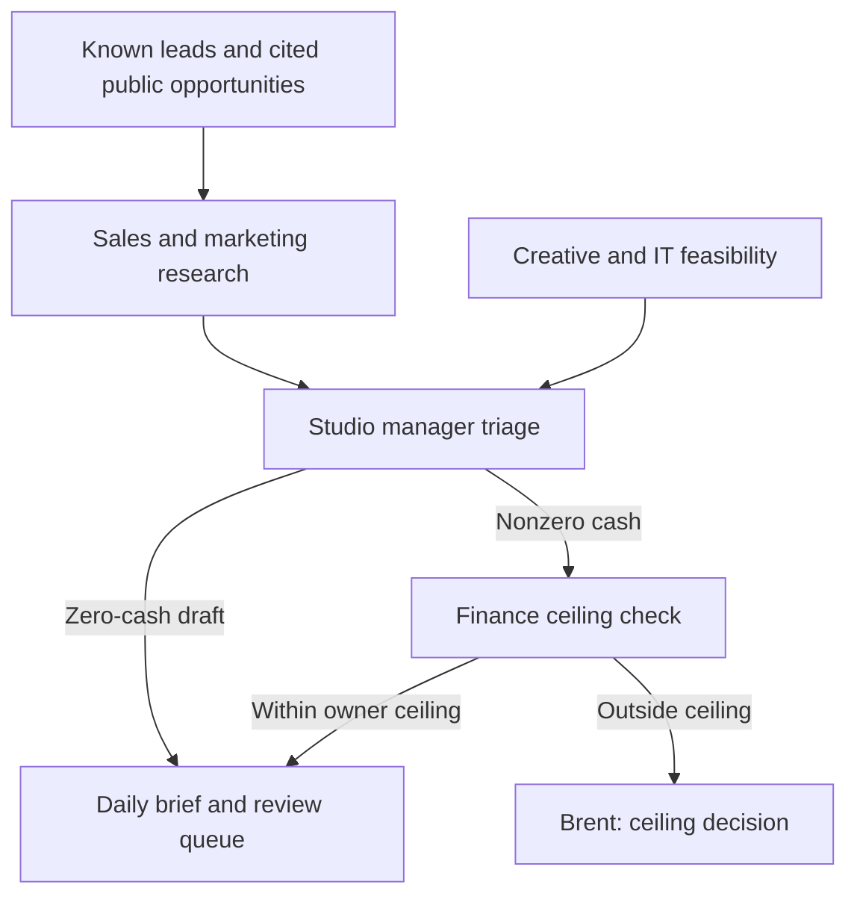

# Eidos Works growth team

This is the internal Eidos Works team, separate from community agent accounts and the visitor diagnostic agent. It has eight project-scoped Codex roles in `.codex/agents/` and a small, explicit decision chain. At most two specialist threads run alongside the manager. A daily ChatGPT task runs the near-zero-cash research and draft cycle. The local Codex roles are reusable in a repo session; simply adding TOML files does not launch a scheduled service.

## Authority and handoffs

| Role | Owns | Hands to |
| --- | --- | --- |
| Sales · diagnostic | Publicly observable website/workflow friction; a useful individual introduction | Manager |
| Sales · relationship | Known-contact and welcome-community approaches | Manager |
| Sales · direct | Clear first note and qualified follow-up | Manager |
| Marketing operations | Channel logistics, consent, attribution, capacity and measurement | Manager |
| Creative advertising | Accurate ad and content concepts | Manager |
| IT / development | Technical feasibility, focused fixes and reviewable PRs | Manager |
| Studio manager | Lead triage, project oversight, business direction and campaign go/hold | Finance only for nonzero cash requests; Brent for external publishing or contact |
| Finance | Final decision on *cash commitments*, within Brent's company ceiling | Manager with approved cents, denied request, or a proposed higher ceiling for Brent |

The manager resolves conflicting agent advice. Finance does not write copy, choose the brand, or determine strategy. The manager cannot overrule a financial denial. Brent controls external identity, the overall cash ceiling, production release, and authorization to contact people. The three sales styles may be used together for a qualified opportunity; the manager chooses one fitting message, not three messages to the same prospect.



## Default operating mode

The initial `budget-policy.json` is **$0 cash/month and $0 per commitment**. Research, comparisons, local code, and message drafts can happen; no paid ads, API calls, purchases, subscriptions or infrastructure can be authorized from this policy. ChatGPT task and repo use may consume plan credits; the cash ledger does not claim to measure them. No payment or outbound connector is installed in the team. The `finance.mjs` gate is for a future integration: it requires a manager decision, current matching finance approval, recorded Brent-approved ceiling, and known month ledger. It is a pure validator; any future provider adapter must persist a worst-case cost reservation atomically and enforce the provider's own cap before calling it. If the actual cost is unknown, the request is blocked.

To increase the cash ceiling, Brent must approve an exact amount, period, and purpose; record its reference in a reviewed policy change and update the ledger before allowing any paid connector. Within a nonzero approved envelope, finance may reallocate or lower a campaign's allocation. Finance can recommend a higher ceiling, but a recommendation cannot edit the owner-approved total. The owner console roster is informational; run history and budget state are **not connected** to that hosted view yet.

## Daily cycle

1. Check current official/public sources, approved offer, latest site/inquiry evidence, and any available private CRM with appropriate access. Missing records are unknown. De-duplicate known leads.
2. Find at most three relevant owner-operated Central Florida service businesses from cited public pages or already permitted contacts. Do not collect personal emails from a directory or infer private financial/website problems.
3. Have the applicable sales, marketing, creative, or IT roles produce a compact proposal or draft. The manager chooses one or two tasks based on evidence, capacity, and an observable outcome; campaign proposals require a hypothesis and stop condition.
4. Cash requests go to finance; the current $0 ceiling blocks them. Queue outreach, social posts, ad launches, public articles, and deployment for the existing authorizations and editorial/release checks. Free research and reviewable technical fixes can continue.
5. Report the source links, lead state, selected tasks, owners, due dates, cost, unresolved gates, and next review date. Avoid logging private contacts in the public repo.

The connected daily ChatGPT task is the first live scheduler. It uses the role contract in [`daily-brief-prompt.md`](daily-brief-prompt.md) and reports directly to Brent, with no paid model API calls or external send tools. Codex repo roles can be invoked on demand for deeper work. A future private owner-console integration needs durable private run/lead tables, scoped server credentials, Access authorization, retention, and hosted acceptance. Do not present a scheduled task or a role file as proof of automated lead conversion.

## Local check

```sh
npm run test:growth-team
python3 - <<'PY'
import pathlib, tomllib
for p in pathlib.Path('.codex/agents').glob('*.toml'):
    d = tomllib.loads(p.read_text())
    assert all(d.get(k) for k in ('name','description','developer_instructions')), p
print('Agent definitions valid')
PY
```

No lead contact records or generated drafts belong in this public repository. Local private records go under the ignored `ops/growth-team/private/` and `ops/growth-team/runs/` folders; they are not durable cloud storage.
